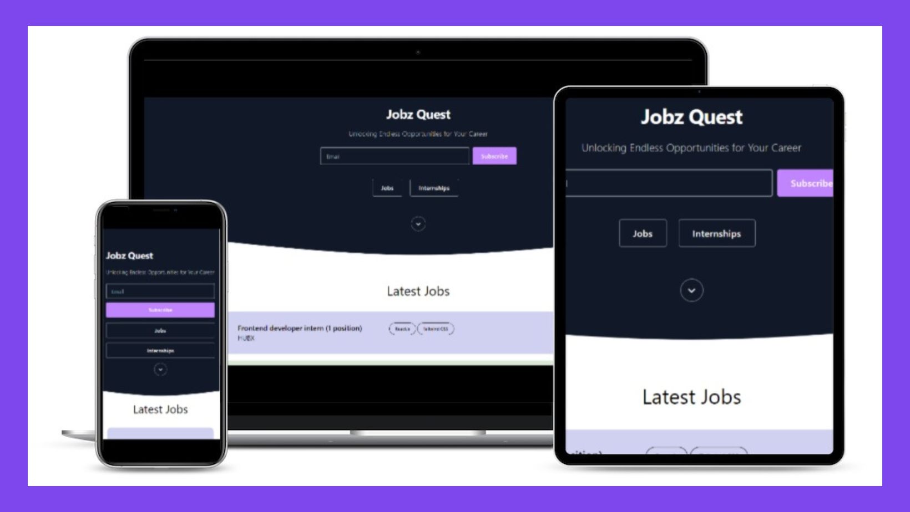

# JobzQuest

JobzQuest is not just a job listing platform, it's an open-source project that believes in the power of collaboration and community. By being open source, JobzQuest encourages developers and contributors to join forces and enhance the platform's functionality and scalability. 

Together, we strive to build a robust ecosystem that benefits job seekers. With the open-source approach, JobzQuest fosters innovation, transparency, and inclusivity, ensuring that the platform evolves with the ever-changing needs of the job market. 

Join the JobzQuest community today and be a part of shaping the future of job searching and career development. Unlock endless opportunities, contribute to open source, and empower individuals on their quest for professional success.

Here is an link of a JobzQuest https://theritikchoure.github.io/JobzQuest/

;

## Tech Stack

JobzQuest is built using the following technologies:

- [Javascript](https://developer.mozilla.org/en-US/docs/Web/javascript) - a just-in-time compiled programming language
- [Tailwind CSS](https://tailwindcss.com/) - a utility-first CSS framework      

## Join our Open-Source Community
JobzQuest is an open-source project, driven by the collaborative efforts of developers like you. Contribute to the platform's growth and improvement by joining our vibrant community.